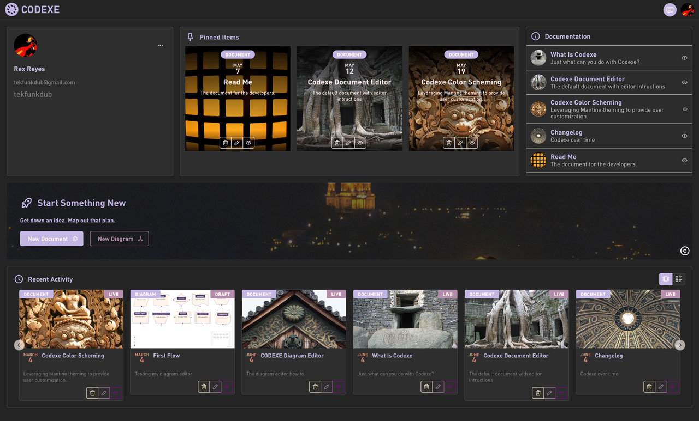

# CODEXE

## Overview

CODEXE is a project I started so I could experiment with building user-authenticated Amplify applications in AWS.  It is built with Next/React, uses graphql for database calls and S3 for file storage.  At this time you can create edit and save documents and use a AI conversational interface.

## Install

If you would like to set up your own CODEXE server, you will need an AWS account. Fork this repo into your GIT, then goto the AWS Amplify Console and create a (GEN 1) app.  Then point the app to the repo, and it will start building everything.

[http://localhost:3000](http://localhost:3000/)

All new accounts are assigned a *Guest* level role which cannot upload to S3 or use the Chatbot so goto the Amplify Studio or Cognito and add your account to at least the *User* group.

You will also need to make the root /public folder of the S3 bucket publicly viewable. I felt that the whole signed URL was overkill for now.

## Current Features

### Dashboard
Astronomy Picture of the Day
### Documents
Create Edit Save and Organize Markdown Documents
### Diagrams
Create Edit Save and Organize Flowcarts
### Chatbot
Anthropic Claude AI Assistant
### Profile
Add avatar. Choose Theme

## Planned Features

## Stack Details

### Front End
react
nextjs
mantine
milkdown
xyflow
ai

### Back End
Amplify
App Sync
DynamoDB
Cognito
Lambda
S3

## License

MIT